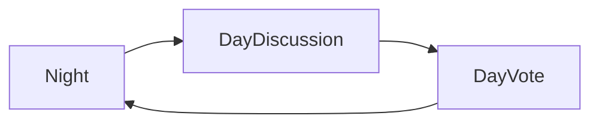

# AI Mafia


A social deduction game where 10+ AI agents (powered by LLMs) play Mafia: Mafia, Doctor, Sheriff, and Villagers. Night actions (eliminate, protect, investigate) and daytime discussion and voting are driven by Pydantic AI with configurable providers: OpenAI, Anthropic, Google (Gemini), Ollama (local), Ollama Cloud, and Grok (xAI).

**What is this?** AI Mafia is a social deduction game (Mafia/Werewolf style) where AI agents—or a mix of AI and human players—take the roles of Mafia, Doctor, Sheriff, and Villagers. You create a game, choose your LLM provider and models (or use local Ollama), and either watch or join as the AI argues, votes, and performs night actions. Everything is driven by LLMs via [Pydantic AI](https://ai.pydantic.dev/).

Note: This Project was inspired by Turing Games video where they played a much cleaner version of this 

Icons and app assets live in [`frontend/public/`](frontend/public/) (e.g. logo, favicon).

## App preview


## Stack

- **Backend**: Python, FastAPI, Pydantic AI, game engine (pure state machine)
- **Frontend**: React (Vite), TypeScript, modern dark theme
- **Run**: Docker Compose (backend + frontend) or local

## Quick start (Docker)

1. Copy env and set at least one API key (optional for local Ollama). See **Environment variables** below for all options.
   ```bash
   cp .env.example .env
   # Edit .env with your API keys (see Environment variables section).
   ```
2. Run:
   ```bash
   docker compose up --build
   ```
3. Open http://localhost:3000 (frontend). API at http://localhost:8000.

## Quick start (local)

1. Backend:
   ```bash
   pip install -r requirements.txt
   cp .env.example .env   # see Environment variables below
   uvicorn api.main:app --reload --port 8000
   ```
2. Frontend:
   ```bash
   cd frontend && npm install && npm run dev
   ```
3. Open http://localhost:5173 (Vite proxy forwards /games to backend).

## Environment variables

Create your env file by copying `.env.example` to `.env`. You need at least one provider’s API key (except when using local Ollama only).

| Variable | Purpose | Required? |
|----------|---------|-----------|
| `OPENAI_API_KEY` | OpenAI API key; also used as default/fallback when another provider’s key is missing | Yes if using OpenAI (or as fallback) |
| `ANTHROPIC_API_KEY` | Anthropic (Claude) | Optional |
| `GOOGLE_GENERATIVE_AI_API_KEY` | Google Gemini | Optional |
| `XAI_API_KEY` | xAI (Grok) | Optional |
| `OLLAMA_BASE_URL` | Local Ollama base URL (default `http://localhost:11434/v1`) | Optional, for local Ollama |
| `OLLAMA_API_KEY` | Ollama Cloud (ollama.com) | Optional |
| `DEFAULT_PROVIDER` | Default LLM provider when not set in UI (e.g. `openai`) | Optional |
| `DEFAULT_MODEL` | Default model when not set in UI (e.g. `gpt-4o-mini`) | Optional |

## How the game works

Each round follows three phases in order: **Night → Day (discussion) → Day (vote)**, then the next round starts again at Night.

The game is **step-based**: it does not auto-run. The frontend (or any API client) advances the game by calling **Next step** (`POST /games/{id}/step`). Each step does one of:

- **Night** – Resolve night actions: Mafia choose a kill target, Doctor choose who to protect, Sheriff choose who to investigate. If any of these roles is a human player, the backend waits for their action via `POST /games/{id}/action` before continuing.
- **Day discussion** – One player (AI or human) speaks in turn. When all discussion turns are done, the phase moves to vote.
- **Day vote** – Players vote one-by-one (reverse of discussion order). When everyone has voted, the eliminated player is applied and the round advances to Night.

When the current actor is a **human**, the API returns `waiting_for_human` and the UI prompts for input. After the human submits their action, the client calls step again to continue.



## API

- `POST /games` – create game (body: `num_players`, `num_mafia`, optional `num_doctor`, `num_sheriff` (0–4 each, constrained by town size), optional `max_discussion_turns`, optional `custom_prompts` (overlay of prompt texts), optional `llm_config`, optional `players`: list of `{ name, provider?, model?, api_key?, is_human? }`; `players` length must equal `num_players` if set)
- `GET /games` – list all game IDs
- `GET /games/{id}` – get public game state (includes `waiting_for_human`, `current_actor_id`, `pending_human_vote_ids`, `pending_human_night_ids`, `human_player_ids`, `current_round_votes` when applicable)
- `POST /games/{id}/start` – no-op (game starts on create)
- `POST /games/{id}/step` – run one step (night, one discussion turn, or one vote); voting is turn-based (one voter per step, order = reverse of discussion order); when the current actor is human, returns state with `waiting_for_human` until the human submits via `/action`)
- `POST /games/{id}/action` – submit a human player’s action (body: `player_id`, `action_type`: `discussion` | `vote` | `night_action`, `payload`: e.g. `{ statement }`, `{ target_id, reason }`, `{ target_id }`)
- `GET /health` – health check (returns `{"status": "ok"}`)
- `GET /settings/env-keys` – returns which provider API keys are set in server env (booleans only; no key values)
- `GET /settings/prompts` – returns default prompt texts (rules, discussion/vote/night templates, summarizer) used by the game

## Features

- **Per-player config**: When creating a game you can pass a `players` array: for each slot set display name, optional provider/model (e.g. Player 1 = o3-mini, Player 2 = Opus), and optionally mark the slot as **human**. Mix AI and human players.
- **Human player**: One or more slots can be "human". When it’s their turn (discussion, vote, or night action), the UI prompts for input and the backend waits for `POST /games/{id}/action` before advancing.
- **Auto-advance**: In the game view, enable "Auto-advance" and set an interval (seconds). The client triggers "Next step" every X seconds. When a human’s turn is active, auto-advance pauses until the human submits.
- **TTS**: Use the "Read aloud (TTS)" toggle in the game view to speak discussion statements, vote reasons, and night-phase messages via the browser’s Web Speech API.
- **Spectate**: When creating a game, check "I am spectating" to watch with all roles and a **Night dialogue** section visible (mafia night discussion and night-action reasoning: who the AI picks to kill/protect/investigate and why).
- **Recent games**: The home screen lists recent game IDs so you can reopen a game without creating a new one.
- **Game view**: Use the **Refresh** button to refetch state; the browser tab title shows the current game ID. The UI uses basic accessibility improvements (e.g. aria-labels, live regions for errors and new content).

## Settings

In the React app, use **Settings** to set default provider, model, and API keys per provider. The UI shows “(set from server)” when a key is provided by server env and the field is empty. When creating a game you can override provider/model per player in the per-player table (order: Provider | Model | Name); the name defaults to the selected model. You can also edit **Prompts** (rules and instruction templates) in Settings; overrides are stored in the browser and sent with new games as `custom_prompts`.

**What happens if you select a model but have no API key for that provider:** If you select a provider (e.g. Claude/Anthropic) and do not set that provider's API key in Settings or in server env, the backend still uses the selected provider and model. Key resolution is: per-player key from the form, else server env for that provider (`ANTHROPIC_API_KEY`, `GOOGLE_GENERATIVE_AI_API_KEY`, `OPENAI_API_KEY`), else fallback to `OPENAI_API_KEY` (see `agents/llm_config.py`, `_env_key_for_provider`). When the fallback key is used for a different provider (e.g. OpenAI key sent to Anthropic), requests for that provider typically fail (invalid key). So in practice only the provider whose key is set will work. Default model when none is specified: per-provider defaults in code (OpenAI: `gpt-4o-mini`, Anthropic: `claude-3-5-haiku-20241022`, Google: `gemini-2.0-flash`), or `DEFAULT_PROVIDER` / `DEFAULT_MODEL` from env if set.

## Tests

```bash
pytest tests/ -v
```

## Project layout

- `game/` – engine, state, rules (no LLM)
- `agents/` – Pydantic AI agents, orchestrator, prompts
- `api/` – FastAPI app, game store
- `frontend/` – React SPA

## About this project

This was a **1-day project** to get better at using **Cursor**. It was "vibe coded"—built iteratively with AI assistance, without a formal spec.
